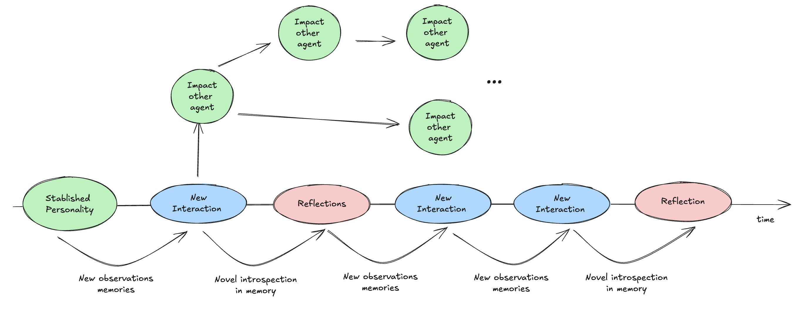
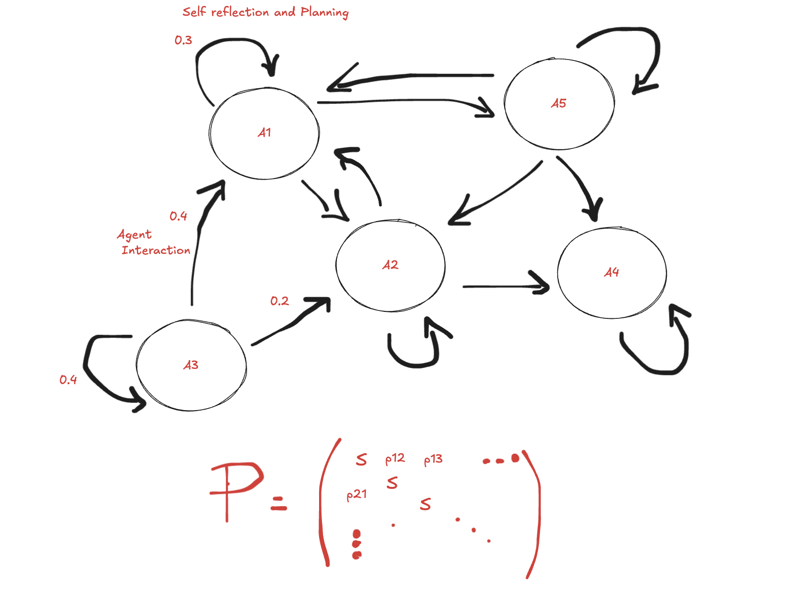
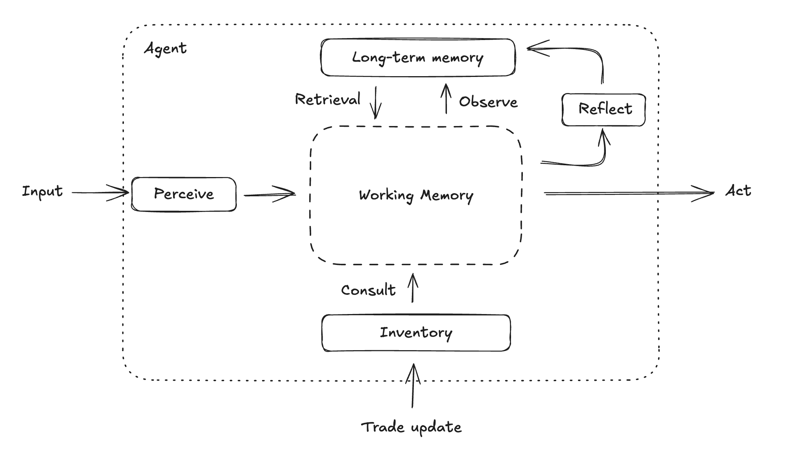
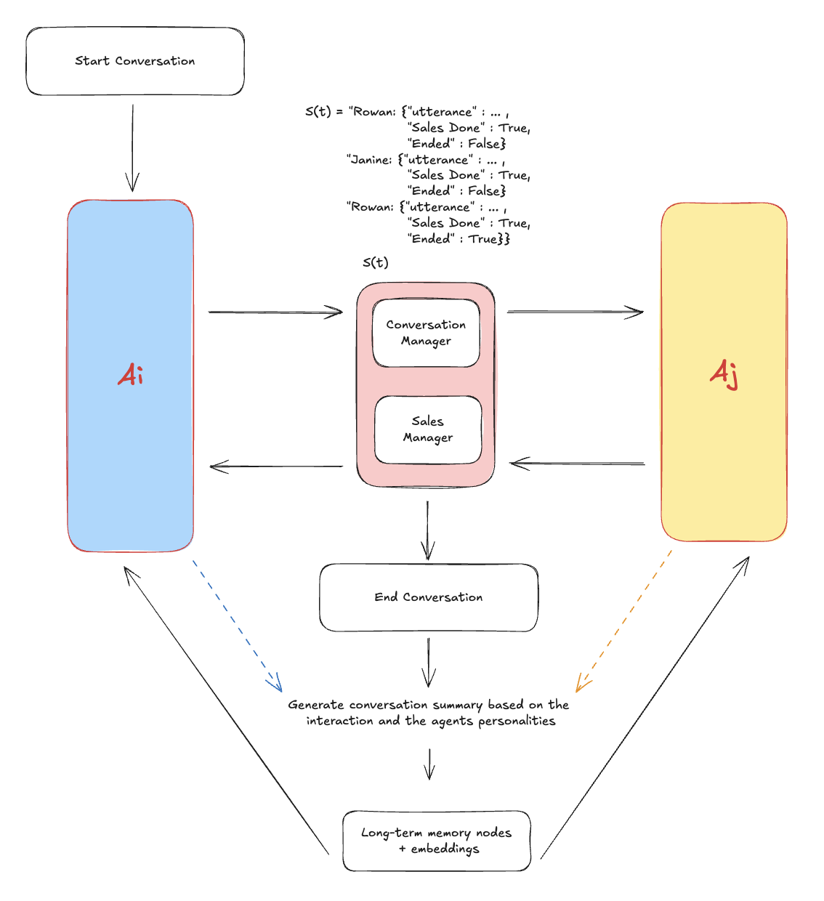

# AgentMarket: Generative Agents in Dynamic Market Networks

## Abstract

Autonomous generative agents powered by large language models (LLMs) and equipped with cognitively inspired modules can simulate complex social dynamics in virtual environments and may ultimately extend to real-world human–machine interactions. Early studies have evaluated such agents in small-scale settings—e.g., social groups, hospitals, and research labs. Building on this foundation, we designed a marketplace of generative agents that buy and sell to one another, enabling us to create merchant leaderboards, design digital sellers, simulate trade behavior, and provide reinforcement-learning environments for trade-focused models. To support this, we enhance prior cognitive architectures—integrating long-term and working memory, reflection, and planning—and introduce new mechanisms for merchant personality, sales management, inventory control, and production planning. To increase realism, we model a time-varying interaction graph as a first-order Markov process: after each defined cycle, edge probabilities are updated from agent preferences and past interactions. In our experiments, the resulting trade patterns mirror human behavior: agents develop preferences for sellers based on product attributes, seller personalities, and context, yielding a network whose degree distribution is well-approximated by a log-normal and that exhibits merchant clustering. Agents also exhibit coherent production and sales-planning strategies and, at times, affective attachments to goods. Finally, we identify the most positive and the most negative interactions and examine how they relate to the likelihood of transaction success versus failure.

## 🚀 Quick Start

### Install Dependencies
```bash
pip install -r requirements.txt
```

### Set OpenAI API Key
```bash
export OPENAI_API_KEY="your-api-key-here"
```

### Run the Web Interface
```bash
cd frontend
python app.py
```
Open http://localhost:5002 in your browser to access the real-time simulation interface.

### Run the Simulation

**Option 1: Command-Line Interface (Recommended)**

Run the full simulation with default settings:
```bash
python main.py
```

Or customize simulation parameters:
```bash
# Custom simulation length and cycles
python main.py --mode simulation --steps 200 --weight-update 50 --production-update 80
```
Other functions
```bash
# Interview mode (stateless Q&A)
python main.py --mode interview --agent rowan_greenwood

# Chat mode (stateful conversation)
python main.py --mode chat --agent jasmine_carter

# Initialize all agents
python main.py --mode build-agents

# Trigger agent reflection
python main.py --mode reflect --agent mei_chen --query "What drives your business decisions?"

# Smart production planning
python main.py --mode production --agent carlos_mendez
```

**Available Modes:**
- `simulation` (default) - Full market simulation with all 8 agents
- `interview` - Stateless interview mode for psychological profiling
- `chat` - Stateful conversation with memory retention
- `build-agents` - Initialize all agents with memories and inventories
- `reflect` - Trigger agent reflection and introspection
- `production` - Smart production planning based on sales history

**Simulation Parameters:**
- `--steps` - Number of simulation steps (default: 120)
- `--weight-update` - Markov weight update cycle (default: 40)
- `--production-update` - Production planning cycle (default: 60)
- `--agent` - Agent name for interview/chat/reflect/production modes
- `--query` - Custom reflection query
- `--testing` - Run in testing mode (don't save agents)

The simulation outputs:
- Real-time agent conversations and trade negotiations
- Reflection moments where agents process their experiences
- Trade transactions with item exchanges and value calculations
- Network dynamics showing relationship evolution
- Production decisions based on sales patterns
- Final statistics on agent interactions and market activity

**Option 2: Jupyter Notebook (Interactive)**
```bash
jupyter notebook full_simulation.ipynb
```
Interactive notebook interface with:
- Step-by-step execution and visualization
- Agent state inspection and analysis
- Custom simulation parameters
- Plotting and statistical analysis

## 🧠 What Makes Our Agents Different

These aren't simple NPCs or scripted responses.

- **Cognitive Architecture**: They possess a cognitive architecture inspired by the human cognition.
- **Evolving Merchants**: Each agent specializes in different trades, developing expertise and preferences over time.
- **Memory-Driven**: They form genuine relationships, remember past interactions, and let experiences shape their worldview.
- **Individually Consistent**: Each agent maintains a coherent personality that deepens through reflections and experiences over time.
- **Introspectable**: Interview them Westworld-style to explore their memories, motivations, psychological development and observations.


*Figure 1: How agents evolve from basic merchants to complex, self-aware individuals through interaction and reflection*

## 🌐 Multi-Agent Network: The first-order Markov Chain

Our agents don't exist in isolation - they form a dynamic **multi-agent network** governed by Markov chain principles, where each interaction influences future encounters and relationship development.


*Figure 3: Multi-agent network showing probabilistic interactions and relationship evolution*

### Network Dynamics

#### Markov Chain Interactions
- **State-Dependent Meetings**: Agent encounters are influenced by current relationships and past interactions
- **Emergent Social Structures**: Natural alliance and rivalry formation through repeated interactions
- **Memory-Influenced Transitions**: Past experiences affect the probability of future encounters
- **Trade Route Evolution**: Commercial pathways that strengthen or weaken based on successful exchanges
- **Dynamic Probability Networks**: Agents define the probabilities of the Markov network based on their interactions with other agents - these probabilities are dynamical and change over each time step

#### Autonomous Agent Society
```python
class MarkovAgentChain:
    def simulate_network_step(self, agents: List[GenerativeAgent])
    def calculate_interaction_probability(self, agent1, agent2)
    def execute_autonomous_meeting(self, agent1, agent2)
    def update_network_state(self, interaction_result)
```

## 💰 Merchant Specialization System

Each agent is a **specialized merchant** with unique expertise, developing deeper knowledge and stronger preferences through experience:

### Agent Merchant Profiles Examples

| Agent | Specialization | Background | Trade Philosophy |
|-------|---------------|------------|------------------|
| **Rowan Greenwood** (37, Male) | Herbalism & Forest Products | Associate degree in Botany, runs forest-side stall selling hand-harvested herbs, teas, and salves. Lives in Willowmere, Oregon. | "Sustainability, reciprocity with the land, and practical wellness" |
| **Jasmine Carter** (29, Female) | Environmental Consulting | Bachelor's in Environmental Studies, works as environmental consultant for nonprofits. Lives in Huntsville, Alabama. | "We all have a role to play in protecting our environment" |
| **Carlos Mendez** (45, Male) | Premium Tobacco & Cigars | Agricultural Engineering degree, runs traditional tobacco farm in Vuelta Abajo, Cuba. Master cigar roller preserving Cuban traditions. | "Artisanal craftsmanship and the sacred art of tobacco" |

## 🧠 Advanced Cognitive Architecture

### Self-Awareness Through Reflection

Our agents achieve "self-awareness" through a multi-layered reflection system:


#### Immediate Reflection
- Analysis of current interactions given their personalities
- Emotional state recognition and processing
- Quick consistency checks against core beliefs


### Memory Integration System

- **Episodic Memories**: Specific trading encounters and conversations (long-term memory)
- **Semantic Knowledge**: Accumulated expertise about their specialization (long-term memory)
- **Working Memeory**: Processing memory to act or reflect

## 🧩 Cognitive Architecture

Agent consciousness emerges from five integrated cognitive modules working together:


*Figure 8: The cognitive architecture showing how memory, identity, and reflection create agent consciousness*

**The Five Cognitive Modules:**

1. **Memory Stream** - Long-term episodic memory with embedding-based retrieval
2. **Working Memory** - Active conversation context and temporary thoughts  
3. **Scratch** - Current identity state and personality profile
4. **Inventory** - Material possessions reflecting values and trade history
5. **Reflection Engine** - Meta-cognitive processing for belief updates
6. **Production Planning Engine** - Plans the production of products based on previous interactions and personal preferences


Each module contributes to maintaining personality consistency while allowing natural growth through interactions. The reflection engine periodically synthesizes experiences into insights, updating core beliefs and behavioral patterns.

## 💬 Conversation System Implementation

The conversation system handles natural language interactions through a sophisticated pipeline that integrates memory retrieval, context management, and response generation.


*Figure 9: The conversation system architecture showing the flow from input processing to response generation*

### Core Classes

To be included.

### Conversation Flow Architecture

```
User Input → Working Memory → Memory Retrieval → Context Integration
     ↓                                                    ↓
Response Output ← LLM Generation ← Prompt Construction ←──┘
     ↓
Trade Detection → Inventory Updates → Memory Storage →(p Reflection Triggers; 1 - p Repeat)
```

### Advanced Features

**Memory-Informed Responses**
- Agents reference past interactions and relationships
- Personality consistency maintained across conversations
- Emotional state influences response tone and content

**Contextual Trade Detection**
- Natural language trade negotiations (no explicit commands needed)
- "I'd love some of those herbs you mentioned" → Automatic trade analysis
- Fair value calculations based on agent preferences and market dynamics

**Multi-Agent Conversations**
- Automatic role switching between agents
- Maintains separate working memory contexts
- Cross-agent memory formation and relationship updates

### Example Conversation Processing

```python
# User says: "I'm interested in some calming herbs for sleep"
# Agent processing:

1. Memory retrieval: "I remember talking about chamomile before with ..."
2. Context integration: "Agent seems stressed, wants natural remedies" 
3. Response generation: "I have some lovely chamomile and lavender..."
4. Trade detection: Identifies potential herb sale
5. Memory formation: "Agent interested in sleep remedies"
```


## 🔨 Creating New Agents

You can create new agents using the `create_agent.py` script. This automatically generates memories from a base template and sets up the full agent structure.

### Requirements

To create a new agent, you need:
1. **scratch.json** - Agent's identity (demographics, personality, speech patterns)
2. **inventory.txt** - List of items the agent sells (one per line)
3. **OPENAI_API_KEY** - Make sure you exported the OPENAI_API_KEY

### Example: Carlos Agent Template

The `carlos_agent` in `Synthetic_Base` population serves as a reference example:

**scratch.json** (agent_bank/populations/Synthetic_Base/carlos_agent/scratch.json):
```json
{
  "first_name": "Reginald",
  "last_name": "Flintstone",
  "age": 43,
  "sex": "Male",
  "education": "High school; self-taught in military history",
  "race": "Caucasian",
  "extraversion": 3.0,
  "agreeableness": 2.0,
  "conscientiousness": 8.5,
  "neuroticism": 6.0,
  "openness": 7.5,
  "fact_sheet": {
    "childhood": "...",
    "formation": "...",
    "work": "..."
  },
  "speech_pattern": "Short, assertive tone...",
  "self_description": "...",
  "private_self_description": "..."
}
```

**inventory.txt** (agent_bank/populations/Synthetic_Base/carlos_agent/inventory.txt):
```
propeller hat
reinforced umbrellas
raincoats
nuclear energy drink
```

### Creating a Single Agent

```bash
python -m generative_agent.create_agent --name agent_name --population Synthetic_Base --text inventory.txt
```

This command will:
1. Generate memories from the scratch.json template using LLM
2. Create full agent structure in both `Synthetic_Base` and `Synthetic` populations
3. Save generated memories to `agent_bank/populations/memories/{agent_name}_memories.py`
4. Initialize inventory with items from inventory.txt

### Creating All Agents at Once

You can batch-create all agents found in a population directory:

```bash
# Create all agents in Synthetic_Base with default inventory.txt
python -m generative_agent.create_agent --all

# Create all agents with custom text file
python -m generative_agent.create_agent --all --population Synthetic_Base --text custom_inventory.txt
```

This will automatically:
- Scan the population directory for all agent folders
- Process each agent that has both `scratch.json` and `inventory.txt` (or specified text file)
- Generate memories and inventory for each agent
- Provide a summary report showing which agents succeeded/failed

### Steps to Create Your Own Agent

1. Create agent directory structure:
```bash
mkdir -p agent_bank/populations/Synthetic_Base/your_agent_name
```

2. Create `scratch.json` with agent identity (use carlos_agent as template)

3. Create `inventory.txt` with items (one per line)

4. Run the create_agent script:
```bash
python -m generative_agent.create_agent --name your_agent_name --population Synthetic_Base --text inventory.txt
```

The agent will be ready to participate in simulations with a fully generated memory stream, personality, and inventory.
